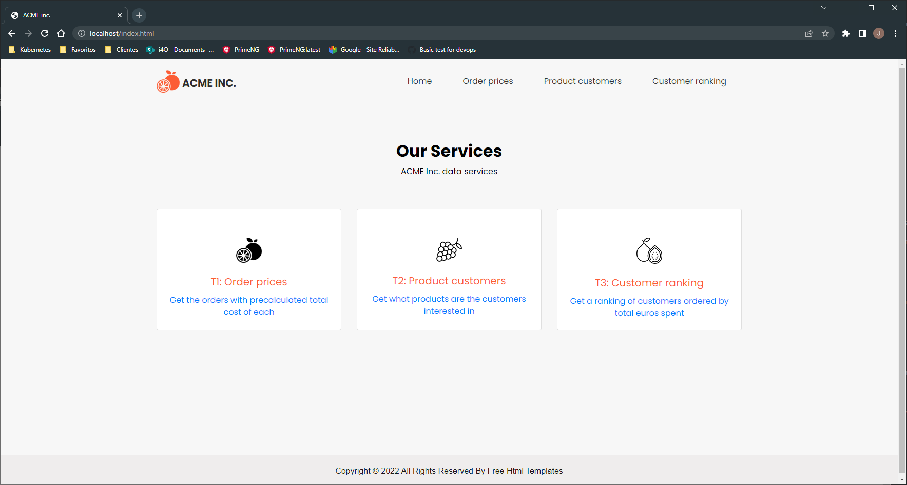
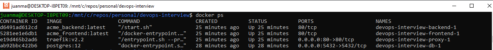

# Overview

Choose whatever language you're most comfortable with to solve these problems.

# Exercise

The ACME inc. tool supply company manages its operations with 3 csv files:

1. `customers.csv` keeps customer information:
    * `id` is a numeric customer id
    * `firstname` is the customer's first name
    * `lastname` is the customer's last name
2. `products.csv` keeps product info:
    * `id` is a numeric product id
    * `name` is the human-readable name
    * `cost` is the product cost in euros
3. `orders.csv` keeps order information:
    * `id` is a numeric order id
    * `customer` is the numeric id of the customer who created the order
    * `products` is a space-separated list of product ids ordered by the customer

Manually dealing with those files is hard and error-prone, and they've asked for your help writing some code to make their lives easier.

### Task 1

Right now the `orders.csv` doesn't have total order cost information.

We need to use the data in these files to emit a `order_prices.csv` file with the following columns:
* `id` the numeric id of the order
* `euros` the total cost of the order

### Task 2

The marketing department wants to know which customers are interested in each product; they've asked for a `product_customers.csv` file that, for each product, gives the list of customers who have purchased this product:
* `id` numeric product id
* `customer_ids` a space-separated list of customer ids of the customers who have purchased this product

### Task 3

To evaluate our customers, we need a `customer_ranking.csv` containing the following columns, ranked in descending order by total_euros:
* `id` numeric id of the customer
* `firstname` customer first name
* `lastname` customer last name
* `total_euros` total euros this customer has spent on products

# Solution
As a solution provided, I have opted to do a web application. 

The solution is composed by 4 components, each of them running on a separate container and properly isolated 
* Frontend
* Backend
* Proxy
* Database

## How to get the project up and running
### Prerequisites
* Docker
* Docker-compose

### Step 1
First, make sure that the docker engine is running.  
Then, move to the repository root and execute the following command to get up the project: `docker-compose up -d`  
The first execution will attempt to find the images and, when it fails, it will build them, so it will take a while.

### Step 2
When the images are built, we must make sure that all the containers are running. With `docker ps` we should see something similar to the following output:

If not, just launch again the above command (`docker-compose up -d`)

Once the project is up with the four containers in Up status, we can go to the browser and open [http://localhost](http://localhost)  

We should see the index page, with the three cards in the middle of the screen. 

## How does it work
Every link of the cards at the index (as well as the header links) leads to the respectively page of the task.  
In each page, you will be able to see a table with the results of the data process as well as a link to download a csv file version of the results, as indicated in the tasks.

## Interesting code locations
### Data processing
The code in charge of transformate data to serve to the requests: 
`backend/app/app/services/data_process.py`

### CSV loaders
This code is executed at an early stage of the boot, launched by an internal script in the docker image.  
It makes possible to have a fresh data set on every reboot of the application.
`backend/app/app/db/init_db.py`

### Infrastructure configuration
The `docker-compose.yml` file is in charge of configuring the infrastructure. 